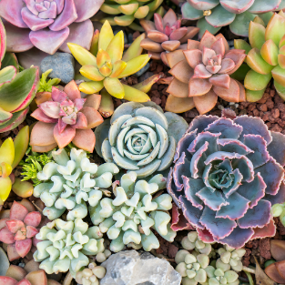
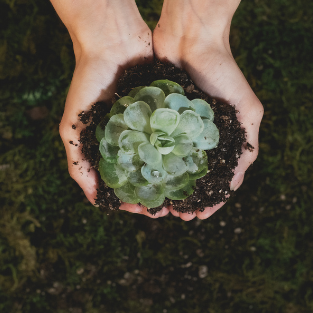
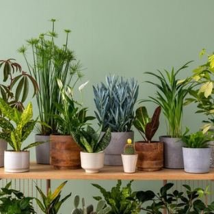
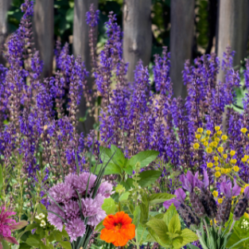
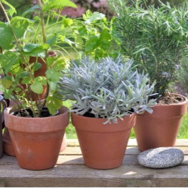
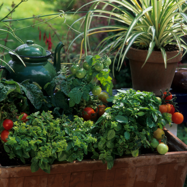
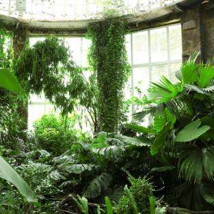

Fiori Favola

FONT TESTI 
- font-family: "Great Vibes", cursive;
- font-family: "Roboto Serif", serif;
- font-family: "Autour One", system-ui;

COLORI

#66b100 (VERDINO)
#027800 (VERDE BOTTIGLIA)
#013b01 (VERDE SCURO)
#9da6ce (LILLA)
#6d77b0 (VIOLETTO)

APPUNTI:

LA NOSTRA STORIA
FioriFavola nasce dalla passione di Alice, una botanica con anni di esperienza nel mondo delle piante. Dopo aver lavorato in vari vivai e giardini, ha deciso di creare il suo vivaio online, dove condividere la sua conoscenza e la sua passione per le piante con il mondo. FioriFavola si impegna a offrire una vasta selezione di piante di alta qualità, insieme a consigli pratici e supporto personalizzato per aiutare gli amanti del verde a creare giardini floridi e rigogliosi. Unisciti a noi in questa avventura verde e scopri il piacere di coltivare la bellezza nella tua vita con FioriFavola.

CITAZIONE
"Ed in mezzo ad un giardino di sogni, ogni pianta è una storia che fiorisce, ogni fiore è un capitolo di bellezza e ogni foglia è una pagina di speranza."

- Piante da Interno e da Esterno:
In questa sezione puoi distinguere tra piante adatte per la casa o l'ufficio e piante da giardino o balcone.

- Piante Fiorite:
Qui potresti presentare una varietà di piante che producono fiori, suddivise per tipologia di fiore o stagione di fioritura.

- Piante Grasse e Succulente:
Questa sezione potrebbe includere una selezione di piante grasse e succulente, ideali per coloro che cercano piante poco esigenti e dalla bellezza rustica.

- Piante Aromatiche:
Puoi offrire una varietà di piante aromatiche e erbe culinarie, utili per la cucina e piacevoli per l'olfatto.

- Piante Tropicali:
Qui potresti presentare piante tropicali, come palme, felci esotiche e piante con fogliame lussureggiante, perfette per creare un'atmosfera tropicale in casa.

- Piante da Frutto e da Orto:
Questa sezione potrebbe includere piante da frutto come alberi da frutto, arbusti di bacche o piante da orto, per coloro che sono interessati a coltivare il proprio cibo.

  <!-- Sezione Categorie -->
  <article class="container-fluid my-2 bg-color-contr">
    

      

      <!-- Colonna IMMAGINE  -->
      

        

          

            

              
            

            

              
            

            

              
            

            

              
            

            

              
            

            

              
            

            

              
            

          

          <button class="carousel-control-prev mx-4" type="button" data-bs-target="#carouselExampleAutoplaying"
            data-bs-slide="prev">
            
            Previous
          </button>
          <button class="carousel-control-next mx-4" type="button" data-bs-target="#carouselExampleAutoplaying"
            data-bs-slide="next">
            
            Next
          </button>
        

      

      <!-- Colonna Titolo  -->
      

        <h2 class="display-6 text-center font-tit">La nostra selezione</h2>
        <h2 class="display-6 text-center font-tit pb-2 pb-md-5">di piante</h2>
        <h6 class="text-center pb-3 lead text-white">Benvenuti nel nostro giardino virtuale, dove la bellezza della
          natura fiorisce in ogni angolo. Scopri le nostre diverse categorie di piante, ciascuna con il suo fascino
          unico. Dalle eleganti Piante Fiorite che catturano lo sguardo con i loro colori vivaci, alle robuste Piante
          Succulente, simbolo di semplicità e resistenza. Assapora l'essenza delle Piante Grasse, testimoni della forza
          e della bellezza della natura selvaggia. E infine, delizia il tuo palato con le fragranze delle nostre Piante
          Aromatiche, pronte a trasformare ogni piatto in un'esperienza culinaria indimenticabile.
          
        </h6>
        

          <a href="./page_3_categories.html" class="btn bottone">...esplora...</a>
        

      

    

  </article>
  
  <!-- Fine Sezione Categorie -->